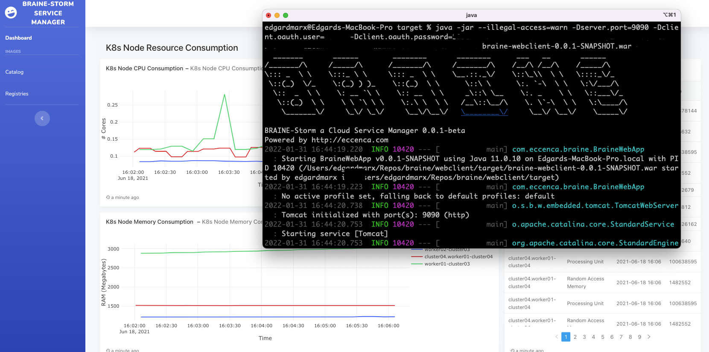

## BRAINE Webclient

The Client UI Application was developed with the intent to facilitate BRAINE Service Orchestration.

Before starting, the following repository containing the project must be cloned locally:

```
$ git clone https://git.eccenca.com/braine/webclient/
```

The client is located in the folder `webclient`.

### Setting up


Before starting the BRAINE webclient a few parameters should be correctly setup in the file `application.properties`, located at the project resource directory.

```
## Spring Tomcat
server.port=7070
client.oauth.user=<user>
client.oauth.password=<password>
```

#### Port

Use the parameter `server.port` to setup the client access port, default `7070`.

#### Connector Authentication

Use the following parameters to setup the client Authentication at the Client UI:

- `client.oauth.user` : use this parameter to setup the user's username.
- `client.oauth.password` : use this parameter to setup the user's password.

#### Running

After setting up the Connector configuration properly, it is time to run.
Execute the command `mvn clean install` at the `webclient` directory inside the repository as following:

```
$webclient % mvn clean install
...
[INFO] ------------------------------------------------------------------------
[INFO] BUILD SUCCESS
[INFO] ------------------------------------------------------------------------
[INFO] Total time:  3.205 s
[INFO] Finished at: 2021-09-28T09:24:22+02:00
[INFO] ------------------------------------------------------------------------
```

Before following the next step, verify if the build was successfully performed.

Go to the project `target` directory and execute the compiled jar with `java`:

```
$target % java -jar -Dserver.port=7070 -Dclient.oauth.user=<user> -Dclient.oauth.password=<password> webclient-0.0.1-SNAPSHOT.war
...
  _______       ______        ________       ________      ___   __       ______
/_______/\     /_____/\      /_______/\     /_______/\    /__/\ /__/\    /_____/\
\::: _  \ \    \:::_ \ \     \::: _  \ \    \__.::._\/    \::\_\\  \ \   \::::_\/_
 \::(_)  \/_    \:(_) ) )_    \::(_)  \ \      \::\ \      \:. `-\  \ \   \:\/___/\
  \::  _  \ \    \: __ `\ \    \:: __  \ \     _\::\ \__    \:. _    \ \   \::___\/_
   \::(_)  \ \    \ \ `\ \ \    \:.\ \  \ \   /__\::\__/\    \. \`-\  \ \   \:\____/\
    \_______\/     \_\/ \_\/     \__\/\__\/   \________\/     \__\/ \__\/    \_____\/

BRAINE-Storm a Cloud Service Manager ...
```

If you have not changed the default port, your client should be accessible at `http://localhost:7070`.
